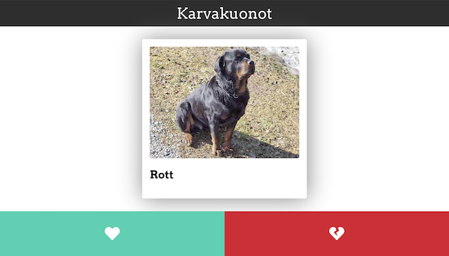

## Datan haku

Seuraavaksi tarvitsemme dataa, jota näyttää sovelluksessamme. Voimme hakea dataa ns. API:n avulla. API on lyhenne termistä _Application Programming Interface_, eli ohjelmointirajapinnasta. API:en avulla eri ohjelmat voivat olla keskenään yhteydessä esimerkiksi internetin välityksellä.

Eräs meidän käyttötarkoitukseemme sopiva API löytyy osoitteesta https://koira-api.herokuapp.com/api/v1/dogs. Jos avaamme osoitteen selaimella, niin näemme jotain seuraavanlaista:


> APIssa käytetty data (Eläinten nimet ja kuvat) ovat peräisin [Rekku Rescuesta](https://rekkurescue.com/). Valitsimme kyseisen palvelun datan, koska koemme yhdistyksen tekemän työn tärkeäksi.

Näkyä ei tule säikähtää, sillä mikäli formatoimme datan, niin se alkaa näyttää tutulta:
```json
[
    {
        "id":8467,
        "url":"https://rekkurescue.com/kissat/otto-2/",
        "title":"Otto",
        "imageUrl":"https://rekkurescue.com/wp-content/uploads/2019/03/53034501_394709921331043_7096889696600457216_n.jpg"
    },
    {
        "id":8534,
        "url":"https://rekkurescue.com/koirat/martta/",
        "title":"Martta",
        "imageUrl":"https://rekkurescue.com/wp-content/uploads/2019/03/marttapää-1.jpg"
    },
]
```
Data on siis muodoltaan JSON:ia. Tämä tarkoittaa siis sitä, että JavaScript osaa suoraan käsitellä kyseistä dataa. Nyt meidän tarvitsee enää hakea data sovelluksemme käyttöön kyseisestä API:sta.

JavaScript sisältää funktion `fetch`, jonka avulla voimme tehdä HTTP-pyyntöjä koodistamme käsin. Luodaan funktio, joka hakee API:stamme haluamamme JSON datan.

```js
const fetchPets = async () => {
  const apiUrl = 'https://koira-api.herokuapp.com/api/v1/dogs';
  const response = await fetch(apiUrl);
  const data = await response.json();
}
```
Funktio `fetch` on ns. asynkroninen funktio, mikä tarkoittaa sitä, että sovelluksemme ei odota funktion suorituksen lopettamista. Tämä johtuu siitä, että joskus `fetch` voi viedä aikaa, emmekä halua blokata käyttöliittymää funktion suorituksen ajaksi. Näin ollen meidän tulee kertoa koodillemme, että odottaa `fetch` funktion palauttamaa arvoa ennen kuin se siirtyy eteenpäin. Tämä on mahdollista komennolla `await`. Komennon `await` käyttäminen vaatii, että funktiomme on asynkroninen. Teimme funktiosta asynkronisen lisäämällä termin `async` funktion määrittelyn alkuun. Muuttuja `response` sisältää HTTP-pyyntömme vastauksen. Käyttämällä sen funktiota `.json()`, joka on myös asynkroninen, saamme haluamamme datan JSON muodossa. Näin ollen muuttuja `data` sisältää hakemamme JSON datan,  joka on lista objekteja. Esimerkiksi `data[0]` palauttaisi objektin, ja `data[0].imageUrl` palauttaisi listan ensimmäisen objektin `imageUrl` arvon.

Seuraavaksi meidän tulee keksiä paikka, missä kutsua juuri tekemäämme funktiota. Sopiva paikka tälle voisi olla sellaisessa `useEffect` hookissa, joka suoritetaan vain silloin kuin komponentti renderöidään ensimmäisen kerran.

```js
useEffect(() => {
    fetchPets()
}, []);
```

**Tehtävä:** Lisää ylläoleva funktio `fetchPets` `App`-komponenttiin ennen effektiä. Muokkaa funktiota siten, että se asettaa muuttujan `pets` arvoksi saamansa datan käyttäen funktiota `setPets`. Lisäksi muokkaa edellisessä tehtävässä tekemääsi effektiä siten, että siellä kutsutaan muokkaamaasi funktiota `fetchPets`.

**Tehtävä:** Muokkaa `Content`-komponenttia siten, että se saa propsina muuttujat `imageUrl` ja `title`. Lisäksi muokkaa komponentin rakennetta siten, että se näyttää saamiensa propsien avulla lemmikin kuvan `img`-elementillä, sekä lemmikin otsikon `h2`-elementillä. Rakenna komponentti siten, että voit käyttää `index.css` tiedostossa kohdan `/* STYLES FOR CONTENT: */` alapuolella olevia tyylejä järkevästi. Anna `Content`-komponentille `App`-komponentissa `pets`-taulukon ensimmäinen arvo. Huomaa, että `pets` on tyhjä siihen asti, kunnes API:mme palauttaa jotakin dataa. Niinpä tulee varmistaa, että listassa on indeksissä `0` dataa, ennen kuin siihen viitataan. Tämä onnistuu esimerkiksi seuraavasti:
```js
<Content imageUrl={pets[0] && pets[0].imageUrl} />
```


Näiden tehtävien jälkeen sovellus näyttää kutakuinkin tältä:




## Callbackit

Komponenteille voidaan välittää myös callback-funktioita, joilla voidaan suorittaa yläkomponentin välittämä funktio alikomponentista. Callbackit ovat hyödyllisiä esimerkiksi tiedon välitykseen alikomponentilta yläkomponentille. Näin voidaan esimerkiksi muuttaa yläkomponentin tilaa alikomponentissa tapahtuvan toiminnan perusteella. Callbackeja välitetään komponentille kuten propsejakin. Callbackit ovat yleisesti käytössä selaimen käyttöliittymätapahtumien yhteydessä.

Alla on kuvattu komponentti, joka ottaa vastaan count-propsin (joka on automaattisesti alustettu nollaksi) ja joka välittää count-propsin alikomponentille CallbackComponent. CallbackComponentille välitetään myös funktio incrementCount, jota kutsutaan kun p-elementtiä klikataan. Kuten propsejakin, myös callbackeja voidaan välittää useamman komponentin läpi.

```js
const ClickComponent = () {
  const [ count, setCount ] = useState(0);

  const incrementCount = () => {
    setCount(count + 1);
  }

  return <CallbackComponent count={count} onClick={incrementCount} />;
};

const CallbackComponent = ({ count, onClick }) {
  return <p onClick={onClick}>The component has been clicked {count} times!</p>;
};
```

Callback-funktioille voi myös antaa parametreja. Alla ClickComponent-komponentin incrementCount-funktiolle annetaan parametri increment, jonka arvoksi CallbackComponentissa annetaan 3. Nyt count-arvoon lisätään 3 aina kun elementtiä p klikataan.

```js
const ClickComponent = () {
  const [ count, setCount ] = useState(0);

  const incrementCount = (increment) => {
    setCount(count + increment);
  };

  return <CallbackComponent count={count} onClick={incrementCount} />;
};

const CallbackComponent = ({ count, onClick }) {
  return <p onClick={() => onClick(3)}>The component has been clicked {count} times!</p>
};
```

## Oma callback

Luodaan seuraavaksi callback funktio aikaisemmin tekemillemme `Button` komponenteille. Lisätään komponentille uusi prop `onClick`, joka kuvastaa funktiota, ja asetetaan se komponentin juurielementille.
```js
const Button = ({ icon, onClick }) => {
  return (
    <div className={icon} onClick={onClick} />
  );
}
```
Lisätään seuraavaksi `App` komponenttiin funktio `handleClick`:
```js
const handleClick = () => {
  console.log('clicked!');
}
```
Voimme nyt antaa luomamme funktion `Button` komponentille, ja aina kun nappia painetaan, niin selaimen konsoliin tulostuu teksti "clicked!". 

Meillä on vielä kuitenkin yksin ongelma: `Button` komponentit sijaitsevat `Footer` komponentissa, emmekä voi suoraan `App` komponentista antaa funktiotamme napeille. Naiivi ratkaisu voisi olla lisätä myös `Header` komponentille samanlainen prop `onClick` ja laittaa se eteenpäin eli "passata" napeille. Tämä koituu kuitenkin kohtaloksi, mikäli haluamme napeille eri `onClick` funktiot. Elegantti ratkaisu olisi se, että muutamme aluksi `Footer` komponentin rakenteen seuraavanlaiseksi:
```js
const Footer = ({ children }) => {
  return (
    <footer>
      { children }
    </footer>
  );
}
```
Prop `children` on sellainen prop, joka annetaan jokaiselle komponentille oletuksella. Esimerkissä
```js
<Component1>
  <Component2 />
  <Component3 />
</Component1>
```
komponentin `Component1` lapsia ovat `Component2` ja `Component3`. Hyöty tässä on se, että voimme nyt käyttää footeria `App` komponentissa näin:
```js
<Footer>
  <Button icon="heart" />
  <Button icon="heart-broken" />
</Footer>
```
Nyt pääsemme suoraan `App` komponentista käsiksi nappeihin, ja voimme antaa niille suoraan `onClick` funktiot.
```js
<Footer>
  <Button onClick={handleClick} icon="heart-broken" />
  <Button onClick={handleClick} icon="heart" />
</Footer>
```

**Tehtävä:** Luo `App`-komponenttiin uusi tilamuuttuja nimeltä `index`, jonka alkuarvo on `0`. Lisää myös funktio `onClick`, joka lisää muuttujan `index` arvoa yhdellä. Lisäksi muokkaa `Footer`-komponenttia samankaltaisesti kuin yllä, jotta pääset `Button`-komponentteihin käsiksi suoraan `App`-komponentista, ja anna napeille prop `onClick`, joka on juuri tekemäsi funktio. Muokkaa myös `Button`-komponentteja siten, että ne käyttävät saamaansa `onClick` funktiota, kun niitä klikataan. Viimeiseksi muuta `App`-komponenttia vielä siten, että se antaa `Content`-komponentille `index`-muuttujan määräämän arvon listasta, eikä aina listan ensimmäistä arvoa.

Tehtävän jälkeen sovelluksen tulisi toimia siten, että aina kun nappia painetaan, niin näytettävän lemmikin kuva muuttuu.

[Nyt voimme julkaista sovelluksen muiden nähtäväksi!](https://codento.github.io/react-workshop-2/julkaiseminen/)