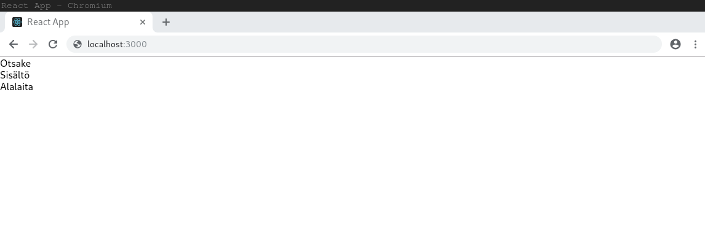

React-sovellukset koostuvat ideaalisti useista pienistä komponenteista, joilla on jokin rajattu vastuualue. Esimerkiksi meillä voisi olla komponentti `Comments`, jonka tehtävä olisi näyttää sivulla johonkin asiaan liittyviä kommentteja, tai sitten komponentti `Avatar`, jonka tehtävä olisi näyttää sille annettu avatari. Kun suunnittelet sovelluksesi toimintaa lähtökohtana on se, että pyrit löytämään ne pienimmät järkevät rakennuspalikat joilla voisit koostaa toimivan kokonaisuuden.

Komponenttien pienuudessa on seuraavat hyödyt:
- Helppo testata
- Voidaan käyttää uudelleen muualla sovelluksessa (tai jopa kokonaan toisessa sovelluksessa!)
- Helpottaa sovelluksen muuttamista myöhemmin
- Helpottaa komponenttien koodin lukemista

Kyseessä on kuitenkin tietynlainen tasapainoilu, sillä  joskus liian pienet ja yksityiskohtaiset komponentit monimutkaistavat sovellustasi tarpeettomasti.

Komponentteihin liittyy monia yksityiskohtia, kuten komponentin elinkaaren hallinta, joka sisältää mm. komponentin alustuksen, eli "mounttaamisen", kun komponentti näytetään ensimmäisen kerran ja purkamisen, eli "dismounttaamisen", kun komponenttia ei enää näytetä sovelluksessa. Keskitymme nyt alkuun kuitenkin pelkästään komponentin esittämiseen, eli miten React-komponentti saadaan näkymään sovelluksessa.

Reactissa on kahdenlaisia komponentteja: luokkakomponentteja ja funktiokomponentteja. Luokkakomponentit ovat olleet pitkään suositumpia, sillä ne ovat tarjonneet enemmän toiminnallisuutta kuin funktiokomponentit. Nykyään kuitenkin myös funktiokomponenteilla voi tehdä kaiken saman kuin luokkakomponenteilla, mutta yleensä tehokkaammin. Lisäksi funktiokomponenttien rakenne on yksinkertaisempi ja niitä on helpompi testata. Niinpä niiden suosio on viime aikoina kasvanut, joten suosittelemmekin käyttämään funktiokomponentteja. Huomaa kuitenkin, että Internetin esimerkeissä saattaa tulla myös luokkakomponentteja vastaan.

### Luokkakomponentit
Olemme tutustuneet jo yhteen luokkakomponenttiin: _CRA_ loi valmiin `App`-komponentin, jota olemme ehtineet muokatakin. Komponentti näyttää tältä:
```js
import React, { Component } from 'react';

class App extends Component {
  render() {
    return (
      <div className="App">
        Hei maailma!
      </div>
    );
  }
}

export default App;
```

Näemme, että komponentti on luokkakomponentti koska komponentti alkaa määrittelyllä `class App extends Component {`. Käytännössä määrittely tarkoittaa sitä, että `App` on luokka, jolla on Reactin itsensä tarjoaman `Component`-luokan toiminnallisuus. `Component`-luokka sisältää paljon esimerkiksi komponentin elinkaareen liittyviä toimintoja, mutta emme esittele niitä tässä sen tarkemmin.

Tärkein toiminnallisuus joka komponentin on toteutettava on `render`-funktio, joka ylläolevassa `App`-komponentissa palauttaa komponentin sisältämän HTML:n. Tämä komponentin palauttama HTML on se, mikä lopulta näkyy selaimessa.

### Funktiokomponentit
Funktiokomponentit ovat hieman erinäköisiä. Alla oleva esimerkki vastaa nykyistä `App`-luokkakomponenttia, mutta se on kirjoitettu funktiokomponenttina:
```js
import React from 'react';

const App = () => {
  return (
    <div className="App">
      Hei maailma!
    </div>
  );
}

export default App;
```

`App`-komponentin määrittely on muuttunut muotoon `const App = () => {` ja nyt HTML-sisältö palautuu suoraan komponentista ilman erillistä `render`-funktiota. Lisäksi enää ei tarvitse tuoda `Component`-riippuvuutta, joten ensimmäisellä rivillä tarvitsee enää tuoda ainoastaan itse React. Huomaa, että komponentin palauttama HTML on sulkeiden sisällä.

`App`-komponentin kohdalla luokka- ja funktiokomponenttien ero ei toistaiseksi ole kovin suuri, mutta funktiokomponentti on jonkin verran yksinkertaisempi. Kun komponenttien toiminnallisuus kasvaa niin funktiokomponentit muuttuvat kuitenkin huomattavasti selkeämmiksi.

> Yllä sanomme, että komponentit palauttavat HTML:ää; se ei aivan pidä paikkaansa. Komponentit itse asiassa palauttavat JSX:ää, jota käsittelemme tarkemmin myöhemmässä osiossa. Tässä vaiheessa kuitenkin riittää ajatella, että komponentti palauttaa vain HTML:ää.

**Tehtävä:** Tee sovelluksesi `App`-komponentista funktiokomponentti kuten yllä.

## Ensimmäiset omat komponentit
Seuraavaksi luodaan kokonaan uusia komponentteja. Haluamme antaa sovelluksemme seuraavannäköisen rakenteen:


Muutetaan sovellusta siten, että sovelluksessa on omat komponentit otsakkeelle, sisällölle, ja sivun alalaidalle.

### Sovelluksen sisältö
Tällä hetkellä sovellus ei tee muuta kuin näyttää tekstin _Hei maailma!_. Luodaan sovellukseen uusi komponentti, joka tulee sisältämään sovelluksen pääasiallisen sisällön. Luo hakemistoon `src/` uusi tiedosto nimeltä `Content.js`. Komponentin sisältö voisi näyttää esimerkiksi tältä:
```js
import React from 'react';

const Content = () => {
  return (
    <main>
      Sisältö
    </main>
  );
};

export default Content;
```
> Huomaa komponentin viimeinen rivi `export default`. Jotta sovelluksessa voidaan käyttää komponenttia, on aina muistettava lisätä tämä viimeinen rivi, joka "vie" luodun komponentin sovelluksen muiden osien käyttöön.

Yllä olemme luoneet `Content`-nimisen komponentin, joka ei vielä tee muuta kuin palauttaa tekstin _Sisältö_. Teksti on lisätty HTML-elementin `<main>` sisälle, sillä kyseessä on sovelluksemme "pääsisältö". Komponentti on funktiokomponentti, joten tiedoston alussa tarvitsee ainoastaan tuoda komponentin riippuvuutena React. `Content`-komponentti muistuttaa hyvin paljon `App`-komponenttia, sillä kummassakaan ei ole vielä paljoa toiminnallisuutta.

Komponentti ei kuitenkaan vielä näy missään, vaan se on lisättävä sovellukseen. Tällä hetkellä meillä ei ole kuin `App`-komponentti, joten lisätään komponentti sinne. Jotta uutta `Content`-komponenttia voitaisiin käyttää `App`-komponentissa, se on tuotava erikseen `App`-komponentin käyttöön kuten Reactkin.

Lisätään rivi `import Content from './Content';` heti rivin `import React from 'react';` jälkeen. Korvataan samalla `App`-komponentissa teksti _Hei maailma!_ uudella `Content`-komponentillamme. `App`-komponentti näyttää muutosten jälkeen tältä:
```js
import React from 'react';
import Content from './Content';

const App = () => {
  return (
    <div className="App">
      <Content />
    </div>
  );
}

export default App;
```

> Jotta voimme käyttää komponentteja muissa komponenteissa, on meidän aina erikseen muistettava tuoda komponentti `import`-lauseella. Yllä tuontilause alkaa `import Content`, koska exporttaamme _Content.js_ tiedostossa komponentin nimeltä `Content`. Tuontilause loppuu `from './Content'`, koska tiedoston nimi on _Content.js_. Tuontilauseet ovat siis muotoa `import komponentin_nimi from 'komponentin_tiedosto'`. Kun tuotava tiedosto päättyy _.js_, niin päätettä ei tarvitse kirjoittaa.

Huomaa, että sovelluksen komponentit ovat kääritty yhden div-elementin sisään:
```javascript
<div className="App">
...
</div>
```   

React vaatii, että komponentti palauttaa maksimissaan yhden juurikomponentin. Näin ollen mikäli haluamme palauttaa enemmän kuin yhden komponentin, niin ne tulee kääriä yhden juurikomponentin sisään:

```javascript
<div>
   <Component1 />
   <Component2 />
</div>
```

**Tehtävä:** Luo funktionaaliset komponentit `Header` ja `Footer` omiin tiedostoihinsa `Header.js` ja `Footer.js`. `Header`-komponentin pitäisi palauttaa HTML-elementti `<header>` joka sisältää tekstin _Otsake_ ja `Footer`-komponentin tulisi palauttaa HTML-elementin `<footer>`, joka sisältää tekstin _Alalaita_. Muokkaa myös `App`-komponenttia siten, että juuri luomasi komponentit näkyvät oikeissa paikoissa.

Kun tehtävät on suoritettu, sovelluksen pitäisi näyttää suunnilleen tältä:



Sovellus on vielä toistaiseksi melko karun näköinen. [Lisätään sovellukseen seuraavaksi hieman tyyliä.](https://codento.github.io/react-workshop-2/tyylit/)