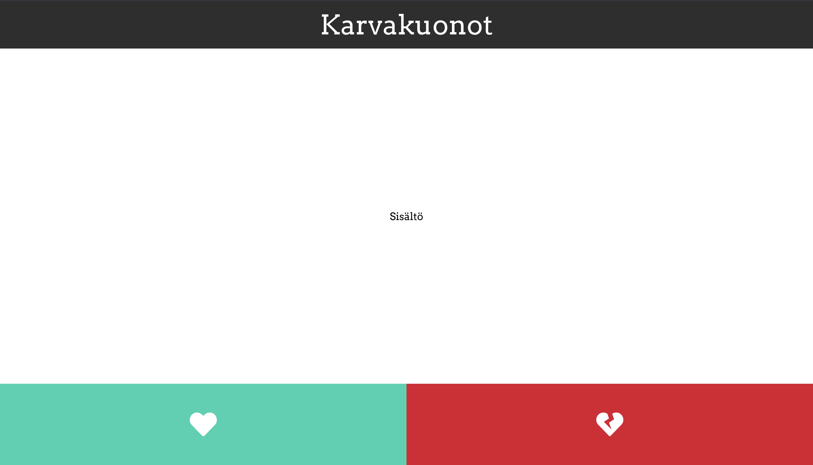

Tilanhallinta on keskeinen asia web-sovelluksissa. Sovelluksen tila määrää, mitä sisältöä näytämme milläkin hetkellä. Tila on siis se, mikä erottaa muuttumattomat (ns. staattiset sivut) muuttuvista (ns. dynaamisista) sovelluksista. Reactin tilanhallinnan keskeisimpiä termejä ovat `props` ja `state`. 

## Props
Komponenttipohjaisten sovellusten päätarkoitus on se, että jaamme sovelluksemme pieniin osiin, eli komponentteihin, jotka ovat itsenäisiä uudelleenkäytettäviä palikoita joita voimme tarpeidemme mukaan yhdistellä suuremmiksi loogisiksi kokonaisuuksiksi. Törmäämme tässä kuitenkin nopeasti siihen, että meidän tulisi pystyä jotenkin kommunikoimaan ja siirtämään tietoa eri komponenttien välillä.

Tätä varten React on suunniteltu siten, että komponentit voivat ottaa vastaan tietoa, eli _props_:eja. Muutetaan aiemmin tekemäämme `Header`-komponenttia ottamaan vastaan propsi nimeltä `title`:
```js
import React from 'react';

const Header = ({ title }) => {
  return (
    <header>
      {title}
    </header>
  );
}

export default Header;
```

Yllä olemme lisänneet funktiokomponentin `Header` parametriksi `{ title }`. Voimme käyttää tätä propsia komponentin palauttamassa HTML:ssä samalla lailla, kirjoittamalla `{title}` elementin `<header>` sisälle.
> Tässä vaiheessa käy ilmi, että React-komponentit eivät palauttakaan pelkkää HTML:ää, sillä HTML:lle ei voi antaa muuttuvaa tietoa kuten `{title}` yllä. React-komponentit palauttavatkin _JSX_:ää, jonka voi ajatella laajentavan HTML:ää. Käytännössä JSX sallii meidän kirjoittavan mitä tahansa JavaScriptiä HTML:n sekaan, kunhan muistamme kääriä JavaScriptin aaltosulkeisiin `{}`. Tämä tekee React-komponenteista todella hyödyllisiä muuttuvan tiedon esittämiseen.

Jotta `Header`-komponentti voisi käyttää propsia `title`, se on jotenkin annettava sille. Propsit välitetään komponentille silloin kun ne lisätään johonkin näkymään. Esimerkiksi kun tällä hetkellä `App`-komponentissa lisäämme komponentin `<Header />` jotta saamme otsakkeemme näkyviin, niin nyt meidän on lisäksi annettava `Header`-elementille attribuutti nimeltä `title`:
```js
import React from 'react';
import Content from './Content';
import Header from './Header';
import Footer from './Footer';

const App = () => {
  return (
    <div className="App">
      <Header title='Karvakuonot' />
      <Content />
      <Footer />
    </div>
  );
}

export default App;
```
Yllä annamme `Header`-elementille attribuutin `title`, jonka arvoksi annamme tekstin `Karvakuonot`. Tämä attribuutti välitetään `Header`-komponentille propsina `title`. Huomaa, että teksti `Karvakuonot` on hipsujen `''` sisällä, jotta React tietää kyseessä olevan tekstiä (myöhemmin annamme propseille muutakin sisältöä kuin pelkkää tekstiä).

Olemme siis tehneet `Header`-komponenttiin seuraavan muutoksen: lisäsimme `Header`-komponentille propsin `title`, jota käytämme `Header`-komponentin palauttamassa HTML:ssä. Koska propsia `title` käytetään komponentin HTML:ssä, niin `Header`-komponentin sisältö muuttuu aina kun propsi `title` muuttuu! `Header`-komponentti siis näyttää aina sen tekstin, joka sille `App`-komponentista annetaan.

Lisäksi lisäsimme `App`-komponentissa `Header`-elementille attribuutin `title`, joka itse asiassa on `Header`-komponentille välitettävä propsi `title`. Toisin sanoen määräämme `App`-komponentista, minkä arvon `Header`-komponentin `title` saa.

Propsit ovat yksi Reactin oleellisimmista ominaisuuksista, ja ne mahdollistavat saman komponentin käytön eri sisällön esittämiseen; voisimme nyt esimerkiksi luoda useita `Header`-komponentteja, joilla on kaikilla eri sisältö koska voimme välittää eri komponenteille eri `title`-propsit.

**Tehtävä:** Muuta `Header`-komponentti ottamaan vastaan propsi `title`, ja välitä sille otsikkoteksti `App`-komponentista.

Propseja voidaan käyttää missä tahansa komponentin palauttaman HTML:n sisällä, vaikka elementtien attribuutteina, eikä pelkästään tekstisisältönä. Esimerkiksi kuvitteellisessa komponentissa (jota emme käytä sovelluksessamme) nimeltä `Avatar`, voisimme antaa propsin `url` jota käytämme kuvan näyttämiseen:
```js
const Avatar = ({ url }) => {
  return (
    
  )
}
```
Yllä `url`-propsi annetaan `img`-elementin `src`-attribuutin arvoksi, eli näytettävän kuvan osoite annetaan komponentille propsina (kts. kertauksesta miten HTML:n `img`-elementti toimii jos se ei ole tuttu).

**Tehtävä:** Luo hakemistoon `src/` uusi tiedosto nimeltä `Button.js`. Luo tähän tiedostoon uusi komponentti `Button`, joka saa propsin nimeltä `icon`. Komponentin tulee palauttaa seuraava sisältö:
```js
<div className={icon} />
```

**Tehtävä:** Muuta `Footer`-komponentti palauttaman _Alalaita_-tekstin sijasta kaksi Button-komponenttia, joista toinen saa propsin `icon` arvona `'heart-broken'` ja toinen arvon `heart`.

Kun ylläolevat tehtävät on valmiit, niin sovelluksen pitäisi näyttää tältä:




> Huomaa, että propseja voi välittää komponentille myös toisella tavalla: sen sijaan, että propsit annetaan komponentille aaltosulkeissa kuten yllä `const Header = ({ title }) => {`, joskus ne näkee annettavan näin: `const Header = (props) => {`. Tämä tarkoittaa käytännössä samaa asiaa, mutta komponentin propsit ovat piilossa props-nimisessä JavaScript-objektissa. On huomattavasti selkeämpää eritellä komponentin propsit aaltosulkeissa, joten käytämme aina tätä tapaa. 

## State
Komponentille annettujen propsien lisäksi komponentilla voi olla oma sisäinen tilansa, eli _state_. Statea voidaan käyttää komponentin sisällä kuten propsejakin, mutta propseja ja statea ei sovi sekoittaa toisiinsa. Propsit ovat jotain mitä komponentille annetaan, kun taas state on jotain mitä komponentti hallitsee itse. Komponentti ei saa muuttaa "vanhemmiltaan" saatuja propseja suoraan, kun taas komponentin sisäistä statea saa muuttaa vapaasti. Toisaalta myöskään "vanhemmalla" ei ole pääsyä "lapsi"-komponenttinsa sisäiseen tilaan.

State saadaan käyttöömme Reactin `useState`-funktiolla, joka tulee ensin importata seuraavasti:

```js
import React, { useState } from 'React';
```

Funktion toiminta on jokseenkin monimutkainen, vaikka staten käyttö itsessään on yksinkertaista. State saadaan käyttöön seuraavan näköisellä funktiokutsulla:
```js
const [count, setCount] = useState(1)
```

Tarkastellaan funktiokutsua tarkemmin. `useState`-funktio palauttaa kaksi arvoa, jotka tallennetaan muuttujiin `count` ja `setCount`. `const [count, setCount]` siis vastaanottaa `useState`-funktion palauttamat kaksi arvoa, ja asettaa toisen arvoista `count`-muuttujaan, ja toisen arvon `setCount`-muuttujaan. Järjestyksellä on tässä väliä, sillä ensimmäinen `useState`-funktion palauttama arvo on itse tila, eli state. Staten alkuarvo on sama mikä `useState`-funktiolle annetaan parametrina (tässä tapauksessa luku `1`). Funktion palauttama toinen arvo on funktio, jolla tilaa muutetaan. Muuttujien nimillä ei kuitenkaan ole mitään merkitystä, eli ylläoleva rivi koodia voisi olla esimerkiksi:

```js
const [kissa, koira] = useState(1);
```

Tämä saattaa vaikuttaa hankalalta, mutta esimerkki helpottanee kokonaisuuden ymmärtämistä:
```js
const [count, setCount] = useState(1)
// count saa yllä arvokseen 1, koska annamme useState-funktiolle parametrin 1
setCount(2)
// countin arvo on nyt 2, sillä setCount on funktio, joka muuttaa countin arvoa
setCount(5)
// countin arvo on nyt 5
```

Eli kun kutsumme `useState`-funktiota jollakin parametrilla, se yksinkertaisesti asettaa annetun parametrin tilaksi ja palauttaa sen ensimmäisenä arvonaan, ja toisena arvonaan se palauttaa funktion, jolla tilaa voi muuttaa. `useState`-funktiolle annettu parametri voi olla mitä tahansa, ja voimme nimetä palautetut arvot miksi haluamme - voisimme esimerkiksi nimetä ylläolevan esimerkin muuttujat `const [number, setNumber] = useState(1)`, ja ainoa mikä muuttuisi on nimet, joilla viittaamme tilaan ja muutamme sitä.

Komponenteille tila annetaan heti komponenttien alussa, jotta olisi selkeää mitä tiloja komponentilla on. Esimerkiksi kuvitteellinen komponentti `Counter`, jolla on tila count, voitaisiin määritellä seuraavasti:
```js
const Counter = () => {
  const [count, setCount] = useState(1);

  return (
    <div>{count}</div>
  ) 
}
```
Ylläoleva esimerkkikomponentti luo tilan `count` (joka saa alkuun arvokseen 1), jonka se palauttaa komponentin näkymänä. React haluaa, että tila määritellään heti komponentin alussa, joten kutsumme `useState`-funktiota heti ensimmäisenä komponentissa. Nyt komponentissa voitaisiin kutsua funktiota `setCount(3)`, jolloin komponentin näkymä päivittyisi automaattisesti. Vielä meillä ei kuitenkaan ole keinoa kutsuta `setCount`-funktiota komponentissa, vaan se esitellään seuraavassa osiossa.

**Tehtävä:** Lisää `App`-komponentille tila kutsumalla `useState`-funktiota komponentin alussa. Aseta `useState`-funktion palauttamat arvot muuttujiin `[pets, setPets]` ja alusta tilan arvoksi tyhjä lista `[]`.

[Seuraavaksi tutustumme komponentin elinkaareen, ja miten tilaa voidaan hyödyntää.](https://codento.github.io/react-workshop-2/elinkaari/)