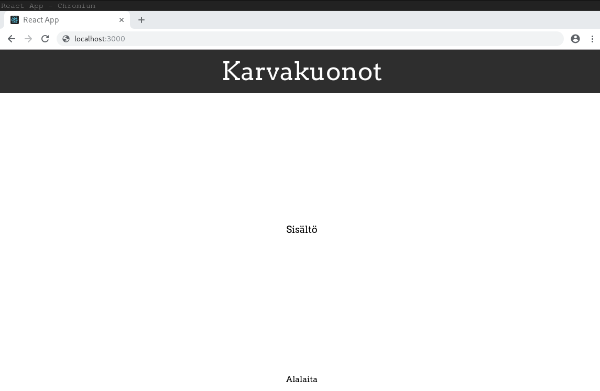

React-sovelluksen komponenteille voi lisätä tyylejä usealla eri tavalla. Käytämme kurssilla yksinkertaista CSS-määrittelyä tyylien lisäämiseen, mutta avainsanoja muihin keinoihin on esimerkiksi _UI-Components_ ja _Styled Components_ mikäli haluat myöhemmin tutustua muihin keinoihin.

Avaa hakemistosta `src/` tiedosto `index.css`.  Korvaa tiedoston sisältö kokonaan kopioimalla [tämän tiedoston](../index.css) sisältö. Jos tunnet CSS:ää voit tutustua tarkemmin tyylimäärittelyihin, mutta tiedoston sisällön ymmärtäminen ei tässä vaiheessa ole tarpeellista.

Näillä muutoksilla olemme lisänneet sovellukseemme tyylit, joita kehtaa esitellä. Mikäli sovelluksesi on käynnissä, selaimen pitäisi päivittyä automaattisesti ja sovelluksen pitäisi näyttää kutakuinkin tältä:

**Tehtävä:** Muuta `Header`-komponentissa oleva _Otsake_-teksti oman sovelluksesi otsakkeeksi. Yllä olemme käyttäneet otsaketta _Karvakuonot_, mutta voit myös käyttää mielikuvitustasi!

Vaikka sovellus näyttää nyt paremmalta, se ei vielä tee mitään. [Seuraavaksi keskitymmekin itse sisältöön.](https://codento.github.io/react-workshop-2/tilanhallinta/)